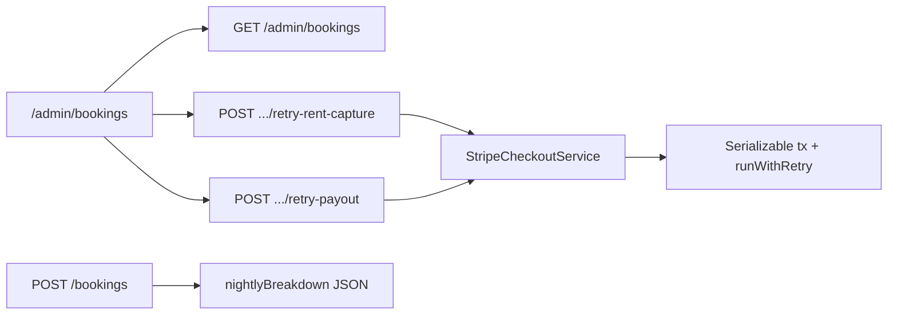

# Admin global bookings list (1A + 2A)

## Decisions locked

- **Money UI:** retry failed rent capture + retry failed host payout only (no cancel / deposit retries)
- **Per-day prices:** persist `nightlyBreakdown` JSON on booking create (migration)

## Architecture

## 1. Schema + quote/create

- Add `nightlyBreakdown Json?` on `Booking`: `[{ date: "YYYY-MM-DD", amount: number }, ...]` (minor units, pre-discount night prices).
- Migration + regenerate client; update seed to set breakdown for seed bookings.
- In `bookings.service.ts` `buildStayQuote`: build the per-night array while summing; expose on `BookingQuoteResult`.
- Persist `nightlyBreakdown` in `booking.create`.
- For legacy rows with `null` breakdown: admin serializer synthesizes equal nights from `nightlyRate` (display-only fallback).

## 2. Enriched admin bookings API

Rewrite `AdminService.getBookings` (today: raw Prisma, weak filters).

**Filters** (extend `QueryAdminBookingsDto`):

- `status` — full set including `AWAITING_PAYMENT`, `PAYMENT_EXPIRED`
- `paymentStatus`, `payoutStatus`, `depositStatus`
- `propertyId`, `guestId`, `hostId` (host profile id)
- `from` / `to` on `checkIn`
- `search` — property title, guest/host name
- `page` / `limit`

**Response** — shared `AdminBooking`:

- Start/end: `checkIn`, `checkOut`, `nightsCount`
- Money: `totalAmount`, `currency`, fees, `discountAmount`, `nightlyRate`, `nightlyBreakdown`
- Statuses: booking / payment / deposit / payout
- Context: property, guest, host
- Flags: `canRetryRentCapture`, `canRetryPayout`

## 3. Money retries (failure-tolerant)

ADMIN-only:

- `POST /admin/bookings/:id/retry-rent-capture`
- `POST /admin/bookings/:id/retry-payout`

Pattern:

1. `runWithRetry` around Serializable `$transaction` that re-reads booking and asserts eligible state.
2. Call existing Stripe ops (`captureRentOnCheckIn` / `payoutToHost`) — already records `PaymentFailure` on error.
3. Harden DB updates with Serializable + conditional status checks so cron + admin retry cannot double-apply.
4. Retry serialization failures (`P2034`) via `runWithRetry`.

## 4. Admin UI

- Page `/admin/bookings` — ADMIN/STAFF gate; retry buttons ADMIN-only when flags true.
- API client + Zustand store + hook (mirror payment-failures).
- Toolbar + table with check-in, total, expandable per-day prices.
- Navbar link + i18n en/hy/ru.

## 5. Tests + quality gate

- Extend admin e2e for filters + retry auth/eligibility.
- api + web lint/format/typecheck; e2e for route changes; `pnpm db:generate`.

## Out of scope

- Admin cancel, deposit release/claim retries, reconstructing rates from live availability.
